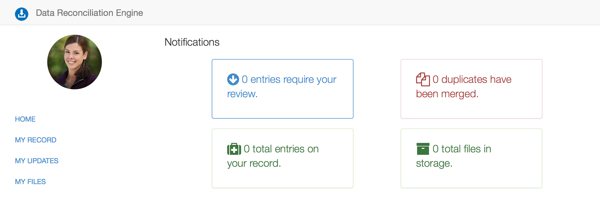
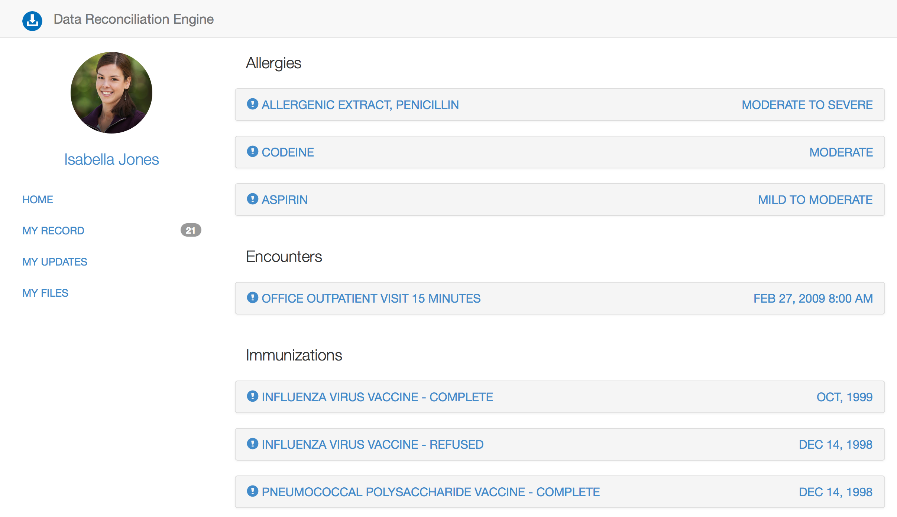
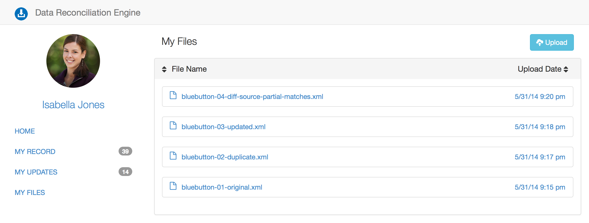
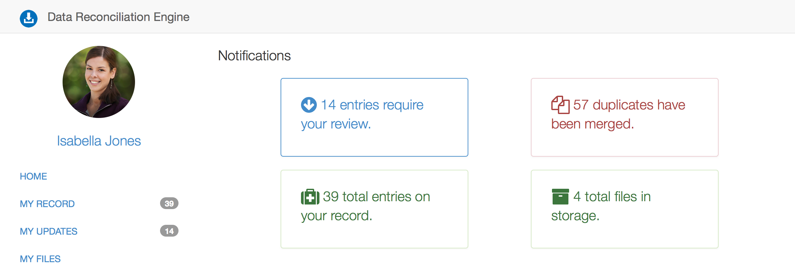
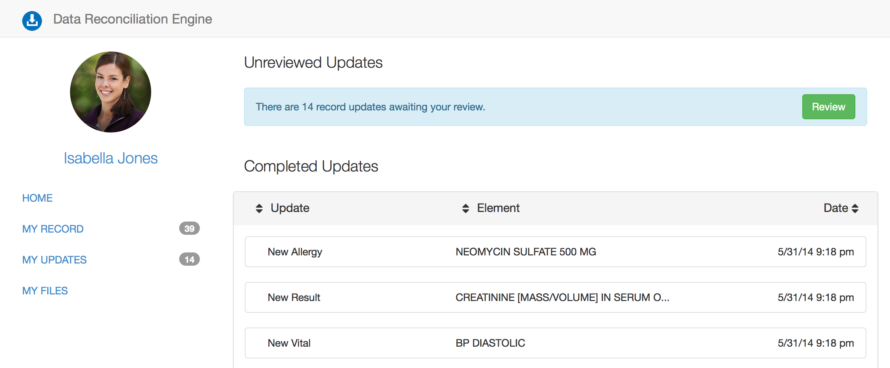
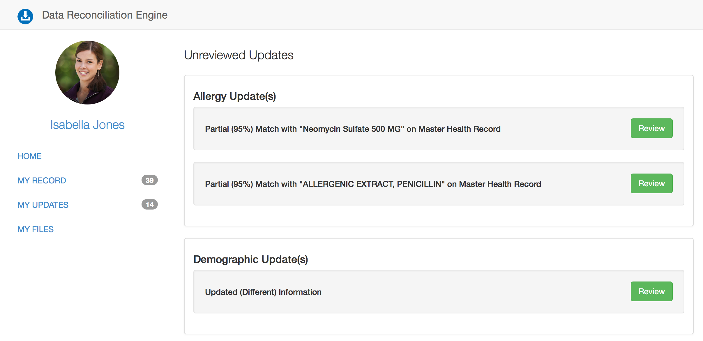
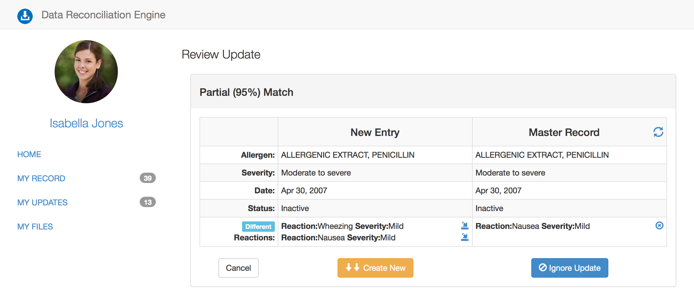

DRE
=========

DRE is demo frontend and Node.js server for reconciling health data.

aka. Raccoon - Data Raccoonciliation Engine for Health Data.


[](https://travis-ci.org/amida-tech/DRE)

High Level Overview
===================


Purpose of Data Raccoonciliation Engine is to take personal health data in variety of formats (starting with BlueButton/CCDA) from multiple sources and parse/normalize/de-duplicate/merge it into single Patient's Master Health Record with patient's assistance (thou, most of hard work will be done automagically).


Raccoon's components
=================


Raccoon has 4 primary elements

#### 1 - Parsing and Normalization Library.

This parses incoming data into a homogenous, simplified data model.  Currently, this is served by bluebutton.js; however this will be refactored into a more efficient, server-only model.

#### 2 - Matching Library.

This takes the standardized data elements and flags probable duplicates values. New patient's records are compared against existing Master Health Record and automatically matched with result produced as all elements of a new record are flagged as duplicates, new and % of match (to be reconciled by patient in a next step).

#### 3 - Reconciliation Interface.

This provides a RESTful API for review and evaluation of duplicates.

#### 4 - Master Record Interface.

This provides a RESTful API for interaction with and access to the aggregated health record.

Documentation for record.js [API](./docs/recordjs.md)

Project Roadmap (tentative)
===============

Release 0.5 (end of April, 2014)
----------------

- Uses existing bluebutton.js lib for parsing (with some fixes/improvements)
- Matching library detects duplicate, new entries, and partial matches
- Reconciliation UI supports duplicate and new entries reconciliation
- Master Health Record library supports persistence to MongoDB
- Data model for CCDA JSON representation is defined for a few sections (e.g. Allergies)

Release 1.0 (end of May, 2014)
----------------

- CCDA JSON data model is fully defined as separate library with validation support
- bluebutton.js parser is rewriten for speed and support of updated CCDA JSON data model.
- Matching library supports % match for entries that may be possible match
- Reconciliation UI support reconciliation of % matched entries (e.g. partial match)
- Master Health Record library supports persistence and full validation of CCDA JSON into MongoDB


Components Documentation
========================

UNDER CONSTRUCTION!!!

Parsing library is refactored and lives at [amida-tech/blue-button](https://github.com/amida-tech/blue-button)
[](https://nodei.co/npm/blue-button/)


Matching library is refactored and lives at [amida-tech/blue-button-match](https://github.com/amida-tech/blue-button-match)
[](https://nodei.co/npm/blue-button-match/)

Reconciliation interface lives at [amida-tech/DRE](https://github.com/amida-tech/DRE)

Master Record library is in process of refactoring and temporarily is part of [amida-tech/DRE](https://github.com/amida-tech/DRE)

###Screenshots of demo app










##Quick up and running quide

###Prerequisites

- Node.js (v0.10+) and NPM
- Grunt.js
- MongoDB

```
# you need Node.js and Grunt.js installed
# and MongoDB runnning

#build client app
cd client
npm install
grunt

#run server side tests
cd ..
cd server
npm install
grunt

#run server
node server.js

# go to localhost:3000 in your browser
```


## Contributing

Contributors are welcome. See issues https://github.com/amida-tech/DRE/issues

## Release Notes

See release notes [here] (./RELEASENOTES.md)

## License

Licensed under [Apache 2.0](./LICENSE)