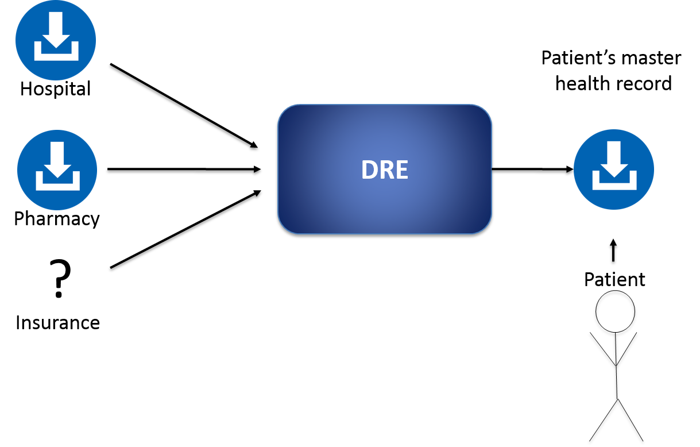
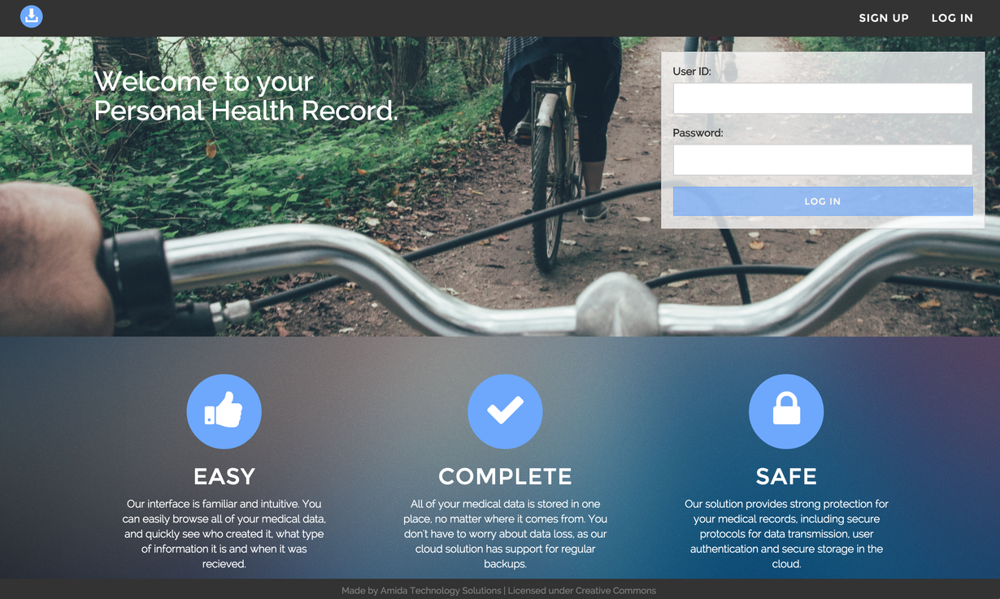
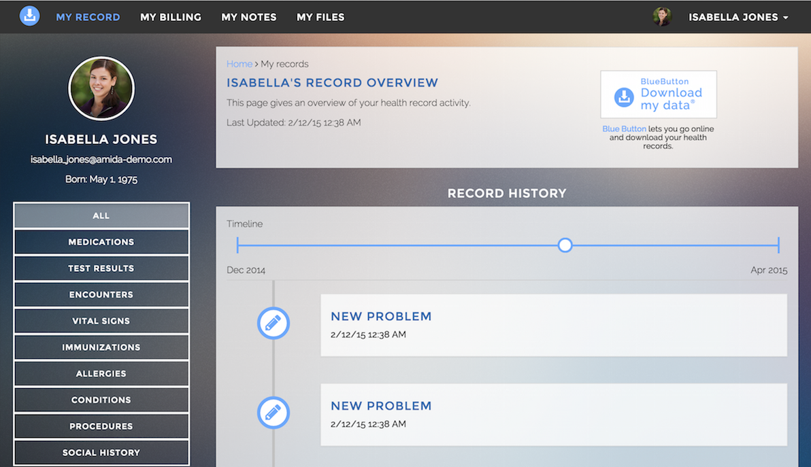
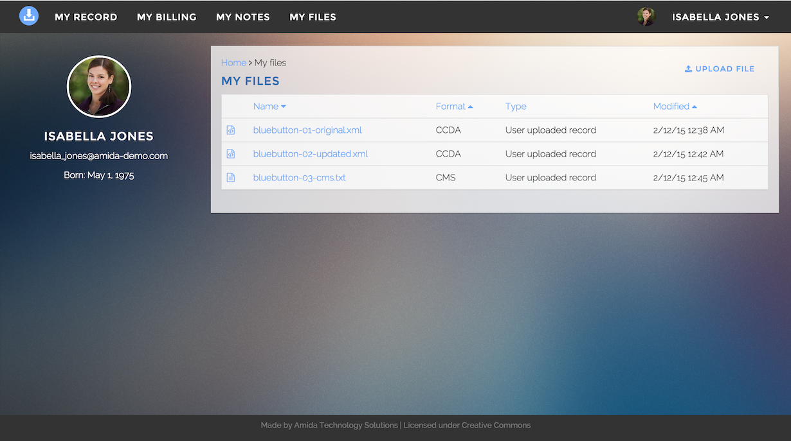
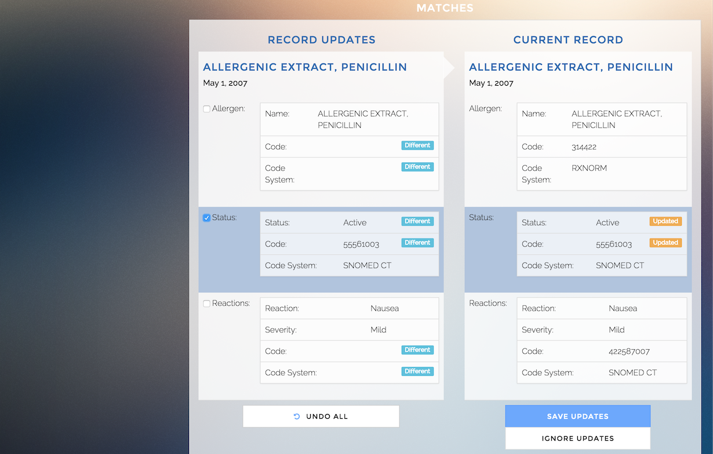
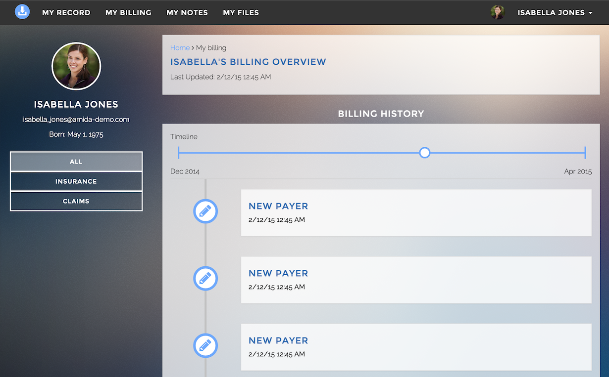
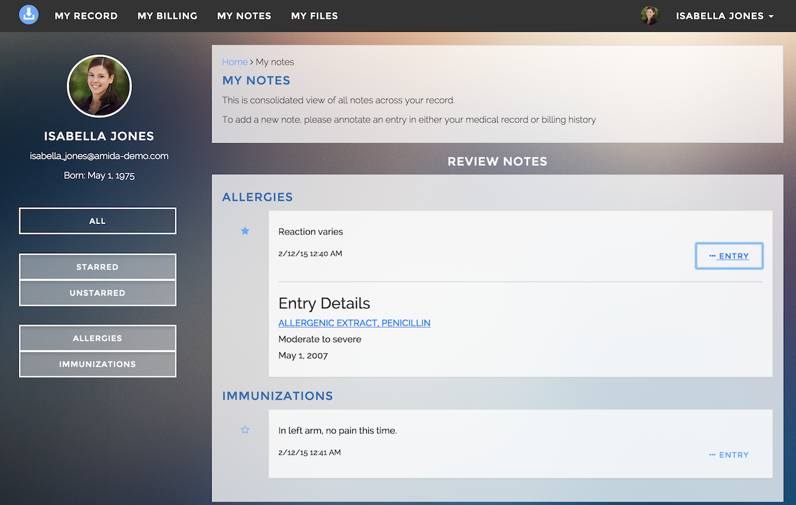
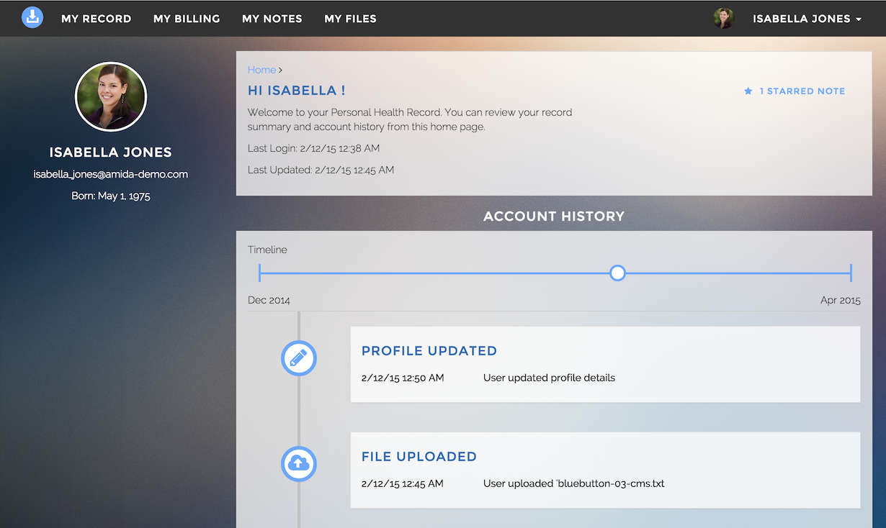

Data Reconciliation Engine (DRE)
=========

DRE is a patient frontend (UI) and Node.js server for reconciling health data.


[](https://travis-ci.org/amida-tech/DRE)

High Level Overview
===================


The purpose of the Data Reconciliation Engine is to take personal health data in a variety of formats (starting with BlueButton/CCDA) from multiple sources and parse/normalize/de-duplicate/merge it into a single Patient's Master Health Record with patient assistance (although most of hard work will be done automagically).


DRE's components
=================


DRE has 4 primary elements

#### 1 - Parsing and Normalization Library.

This parses incoming data into a homogenous, simplified and normalized data model in JSON format. 

Parsing library code: [amida-tech/blue-button](https://github.com/amida-tech/blue-button)


#### 2 - Matching Library.

This takes the standardized data elements and flags probable duplicate values. New patient records are compared against the existing Master Health Record and automatically matched. The result produces a list of all entries in the new record, labelled as duplicates (0 % match), new entries (100% match), or partial matches (to be reconciled by patient in a next step).

Matching library code: [amida-tech/blue-button-match](https://github.com/amida-tech/blue-button-match)

#### 3 - Reconciliation Interface.

This provides a RESTful API and UI for review and evaluation of duplicate or partially matched entries, by the patient.

#### 4 - Master Record Interface.

This provides a API for interaction with and access to the aggregated health record.

Documentation for record.js [API](./docs/recordjs.md)

### Screenshots of the Demo
-		
-		
-	

-		
-		
-		
-


##Quick up and running guide

###Prerequisites

- Node.js (v0.10+) and NPM
- Grunt.js
- MongoDB
- Redis
- Ruby/Compass/Bower

```
# you need Node.js and Grunt.js installed
# and MongoDB + Redis runnning

#build client app
cd client
npm install
bower install
grunt build # you can run "grunt dev" for dev purposes 

#run server side tests
cd ..
npm install
grunt

#run server
node server.js

# go to localhost:3000 in your browser
```

## Contributing

Contributors are welcome. See issues https://github.com/amida-tech/DRE/issues

## Contributors

###### Amida team

- Dmitry Kachaev
- Matt McCall
- Ekavali Mishra
- Jamie Johnson
- Byung Joo Shin (summer '14 intern, UVA)
- Kevin Young (summer '14 intern, UMD)
- Nadia Wallace (winter '15 intern, MIT)

###### PWC team

_We gratefully acknowledge PWC's essential support in the development of the FHIR components of DRE, among other important contributions to codebase of this open source project._

- Afsin Ustundag

## Release Notes

See release notes [here] (./RELEASENOTES.md)

## License

Licensed under [Apache 2.0](./LICENSE)

