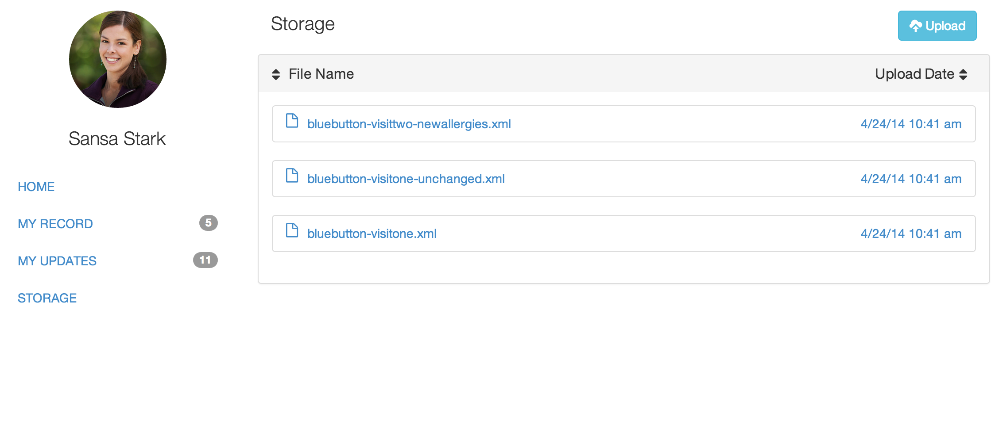
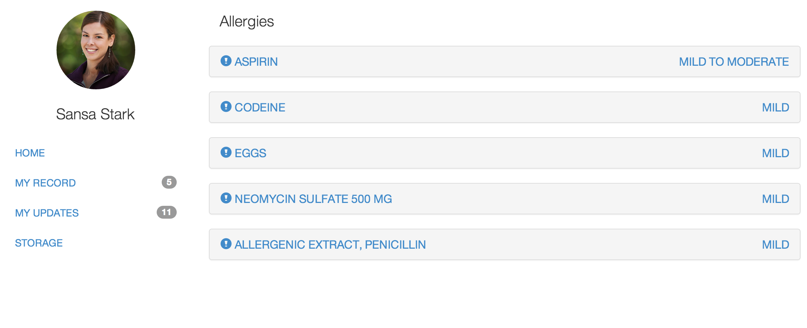
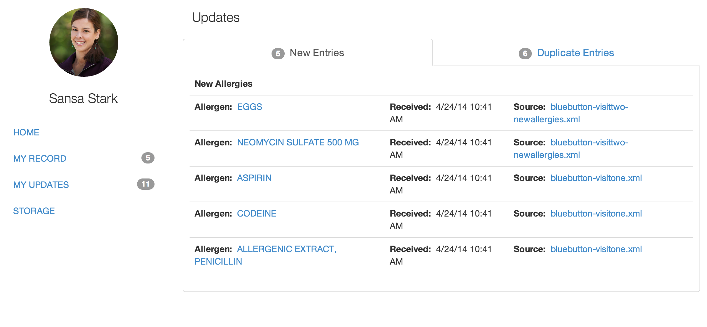

DRE-UX
=========

DRE-UX is demo frontend for Raccoon. [Raccoon](https://github.com/amida-tech/Raccoon) is a node.js Data Raccoonciliation Engine for Health Data.

[](https://travis-ci.org/amida-tech/DRE)
[](https://coveralls.io/r/amida-tech/DRE)


###Prerequisites

- Node.js (v0.10+) and NPM
- Grunt.js
- MongoDB

###Quick up and running quide

```
# you need Node.js and Grunt.js installed
# and MongoDB runnning

#build client app
cd client
npm install
grunt

#run server side tests
cd ..
cd server
npm install
grunt

#run server
node server.js

# go to localhost:3000 in your browser
```

###Screenshots of demo app







## Contributing

Contributors are welcome. See issues https://github.com/amida-tech/DRE/issues

## Release Notes

See release notes [here] (./RELEASENOTES.md)

## License

Licensed under [Apache 2.0](./LICENSE)